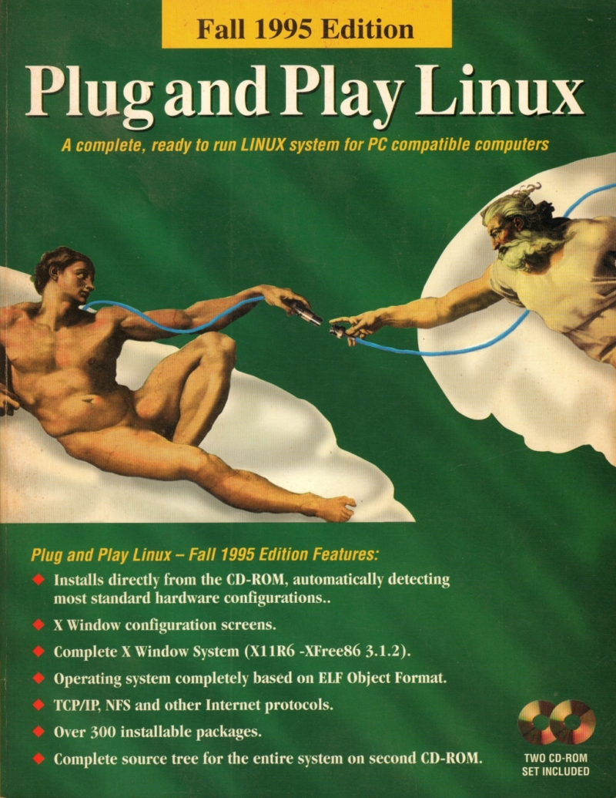

# Yggdrasil notes

The 1995-fall distribution of Yggdrasil has an ATAPI cdrom driver, however before attempting to use it the boot process will try to find a sound blaster type of cdrom at various addresses, this takes a while and can be circumvented with the sbpcd=0 on the lilo command line. An alternative is to edit the default lilo command line in the floppy disk image.

[Install pdf](https://archive.org/download/yggdrasil-plug-and-play-linux-fall-1995-cd/Yggdrasil%20Plug%20and%20Play%20Linux%20%5BFall%201995%5D%20install_.pdf)



## mounting floppy disk image

A loopback driver can be used to mount the floppy disk image for editing

```sudo mount -o loop /home/david/Github/retrodist/yggdrasil/1995-fall/djrm/.cache/boot.img /media/david/floppy1```

On the Yggdrasil distribution the change is made in the SYSLINUX.CFG file in the root of the floppy disk

```
default linux sbpcd=0
timeout 60
display bootmsg.txt
prompt 1
append rw root=0x0101 ramdisk=1440
f1 help1.txt
f2 help2.txt
f3 help3.txt
f4 help4.txt
f5 help5.txt
f8 bootmsg.txt
```

And unmounting when finished editing

```sudo umount /media/david/floppy1```

## scripts

The automatic running of configuration scripts is not yet working, some manual intervention is required.

The drive image containing the scrips needs to be manualy mounted and then the scripts can be invoked.

So far only the disk partitioning script is (mainly) working, it creates a 500MB drive /dev/hda1 and formats it with swap and ext2 partitions

### fdisk config

To run the script the following needs to be typed at the root console:

```
mount -t msdos /dev/hdb1 /mnt
/mnt/autoinst.d/inststep/01.sh 
```

these lines appear as comments in /mnt/autoinst.d/inststep/01.sh the rest of the file invokes command to perform the disk initialisation.

I have edited the supplied diskinit.sh script by removing the later parts mounting the disk etc, the newly partitioned disk is suitable for the yggdrasil installation program without need to repartition.

### tty config

To run the script the following needs to be typed at the root console:

```
mount -t msdos /dev/hdb1 /mnt
. /mnt/autoinst.d/inststep/config.sh 
. /mnt/autoinst.d/confstep/01.sh
```

This script enable a login on ttyS0, this is the QEMU console
sliight improvement is made by setting the TERM enviorenment to 'linux'

```
TERM=linux
export TERM
```


